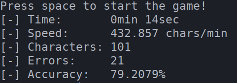

## This is a simple terminal typing game.

> It only works on Linux for now, maybe I'll try to get it working on windows at some point.

### It provides some statistics:

### Usage:
#### Loading "text.txt" in current folder.:
`./typing-game`

#### Loading a specific file:
`typing-game all-of-shakespeare.txt`